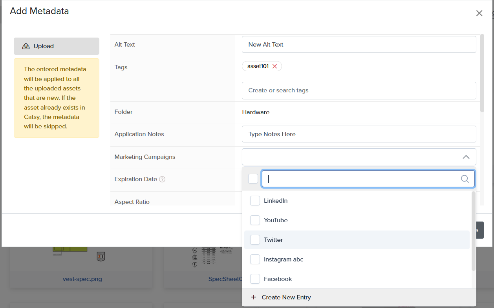

# WooCommerce Integration

Step 1 - We create a WooCommerce Channel for you in Catsy after you share a list of attributes that you want to use 

<figure><figcaption></figcaption></figure>

<figure><figcaption></figcaption></figure>

\
\
\
\
Step 2 - You add the products that you want to publish on your website and ensure that the proper channel attribute mapping has been set and you have selected the correct data source for you so that the attribute data can flow from your Master Attributes in Catsy

<figure><figcaption></figcaption></figure>

\
Step 4 - Catsy provides a product data export that you can use to populate the product data on your website

<figure><figcaption></figcaption></figure>

<figure><figcaption></figcaption></figure>
