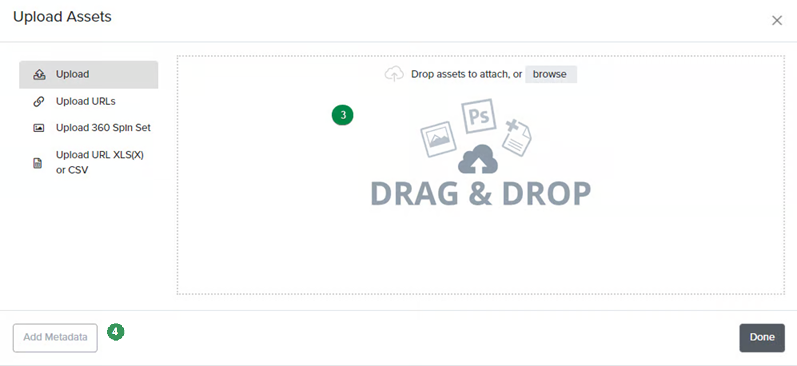

# Import Assets

**Four methods for importing digital assets into Catsy:**

1. [Drag & drop](https://catsy.gitbook.io/docs/dam/import#drag-and-drop)
2. [Paste URLs](https://catsy.gitbook.io/docs/dam/import#urls)
3. [Upload CSV file with URLs](import.md#urls-in-a-csv)
4. [Upload via Product CSV](import.md#upload-via-product-import)

***

### Drag & Drop

For this method to work, you need digital assets on your local computer. This is the most frequently used method where you can drag and drop or upload the files by click on the upload button.

 Go to [https://app.catsy.com/app/digital-assets](https://app.catsy.com/app/digital-assets)

 Click the 'Upload' button on the left.

<figure><figcaption></figcaption></figure>

 Drag & drop your files from your computer folder

<figure><figcaption></figcaption></figure>

 Wait for the upload process to finish and click 'Done'

<figure><figcaption></figcaption></figure>

***

### URLs

If you don't have access to files, but instead of URLs from a server, you can use this method. This method will work as long as the digital assets can be accessed directly from the URL and the images are neither encrypted or intercepted by a viewer.


Limitations of this method:

* It will not work with google links
* It will not work with dropbox links


 Go to [https://app.catsy.com/app/digital-assets](https://app.catsy.com/app/digital-assets)

 Click the 'Upload' button on the left.

<figure><figcaption></figcaption></figure>

 Select 'Upload URLs'

 Paste the URL of the image you would like to upload into the text field and click 'Done.' Enter one URL per line when uploading multiple images

<figure><figcaption></figcaption></figure>

***

### URLs (in a csv)

 Go to [https://app.catsy.com/app/digital-assets](https://app.catsy.com/app/digital-assets)

 Click the 'Upload' button on the left.

<figure><figcaption></figcaption></figure>

 Select 'Upload URL XLS(X) or CSV'

 Upload your file containing urls for assets

<figure><figcaption></figcaption></figure>


The assets are now being uploaded and will soon be ready to be linked to your products. Depending on your cache, you might need to refresh the page


***

### Upload via product import&#x20;

 Go to _Products > Easy Import_

<figure><figcaption></figcaption></figure>

 Select 'Import Products'

<figure><figcaption></figcaption></figure>

 Upload a file that contains one column with product numbers and another column with the main image attribute name and corresponding URL to an image

### Adding metadata during asset upload

 Go to [https://app.catsy.com/app/digital-assets](https://app.catsy.com/app/digital-assets)

 Click the 'Upload' button on the left.

<figure><figcaption></figcaption></figure>

 Drag & drop your files from your computer folder

<figure><figcaption></figcaption></figure>

 Click on "Add Metadata" to full in the asset attribute values

<figure><figcaption></figcaption></figure>

 Type in the data and click "Continue" 

<figure><figcaption></figcaption></figure>


For more information on product data uploads, please review our [Import Products](../pim/import-products/) section.


