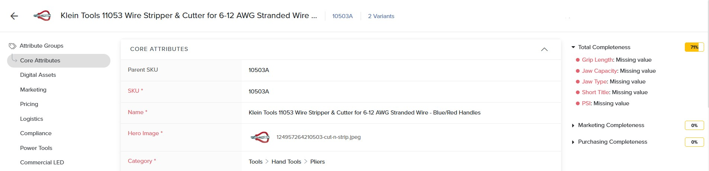

# Product Information Management

<figure><figcaption></figcaption></figure>

### One Source Of Truth For All Product Information

<table data-view="cards"><thead><tr><th></th><th></th><th></th><th data-hidden data-card-cover data-type="files"></th><th data-hidden data-card-target data-type="content-ref"></th></tr></thead><tbody><tr><td></td><td><strong>Aggregate PIM Data</strong></td><td></td><td><a href="../.gitbook/assets/2.png">2.png</a></td><td><a href="import-products/">import-products</a></td></tr><tr><td></td><td><strong>Categorize</strong></td><td></td><td><a href="../.gitbook/assets/3.png">3.png</a></td><td><a href="../mdm/categorization.md">categorization.md</a></td></tr><tr><td></td><td><strong>Enrich Content</strong></td><td></td><td><a href="../.gitbook/assets/4.png">4.png</a></td><td><a href="../mdm/attribute-types.md">attribute-types.md</a></td></tr></tbody></table>
