# Filters

There are several ways to work with filters in Catsy:

1. [Creating filters](filters.md#create-a-filter)
2. [Saving filters](filters.md#save-a-filter)
3. [Saving views](filters.md#save-a-product-view)
4. [Editing filters](filters.md#edit-a-filter-view)
5. [Pinned filters and recently used filters](filters.md#pinned-filters)
6. [Understanding Filter Dropdown Logic for Different Attribute Types (with examples)](filters.md#understanding-filter-dropdown-logic-for-different-attribute-types-with-examples)
   1. [Text String Attribute Filter Options + Examples](filters.md#text-string-filter-options)
   2. [Picklist  Attribute (single-select) Filter Options + Examples](filters.md#picklist-attribute-filter-options-single-select)
   3. [Picklist Attribute (multi-select) Filter Options + Examples](filters.md#picklist-attribute-filter-options-multi-select)
   4. [Other Attribute Type Filter Options](filters.md#other-attribute-type-filter-options)

***

### Create a filter

Filters can be used to filter products displayed based on Attribute filtering. This can be helpful to filter based on Attributes like brand, dimensions, color, categories, or any other Attribute associated with a product. To use a filter, complete the following steps:&#x20;

 Navigate to 'Products' and in the left-hand navigation, select 'Add Filter'

 Select Attribute in list or search for desired Attribute. On the next step, select what kind of condition you would like to add as part of the filter

 When done, click 'Apply'\

<figure><figcaption></figcaption></figure>

 Additional filters can be added by repeating the above steps

 Filters can be saved for convenient access and sharing with others, to do so click 'Save', found in the bottom left corner of the navigation. To share with others, be sure to check 'Share this query with my team'\

<figure><figcaption></figcaption></figure>

Other examples of filters with attributes are filtering on picklist attributes or filtering by category

Filtering by picklist gives the ability to filter on selected options as part of the Attribute. An example could be color. In the example below, once a picklist Attribute is selected, options to pick which colors should be part of the filter appear

<figure><figcaption></figcaption></figure>

***

### Save a filter

 Once all desired filters have been created you can save them for future use by clicking 'Save' at the bottom of the column to the left.

<figure><figcaption></figcaption></figure>

 Name your filter, adjust the privacy settings then click 'Save'

<figure><figcaption></figcaption></figure>

 To apply previously created filters click the _All Products > Filters_ dropdown and select the filter you want to use.

<figure><figcaption></figcaption></figure>

***

### Save a product view

To save a product view along with the filter, follow the steps below:

 Choose the filter that you want to save with a new view

<figure><figcaption></figcaption></figure>

 Change the view to the mode that you want from the available 6 modes

 Save the filter

<figure><figcaption></figcaption></figure>

***

### Edit a filter/view

To edit a filter with or without changing the view, follow the steps below:

 Click on the already applied filter condition. This will open a popup menu

<figure><figcaption></figcaption></figure>

 Change your filter operator and parameters and click 'Apply'

<figure><figcaption></figcaption></figure>

 To change the view, click on the 'View' button and change it to your desired format

 Click 'Save' to save your current filter

<figure><figcaption></figcaption></figure>

***

### Pinned filters

You can also Pin your Filters from the Filter tab.

 Go to _Products > Filters > View all filters_&#x20;

 You can see a list of all Queries and narrow down the list to show only All Queries, only Your Queries or to view the Team Queries. The Yellow Pin indicated which Filters have been pinned and by clicking on the White Pin you can choose which other filters you want to be displayed.

<figure><figcaption></figcaption></figure>

***

## Understanding Filter Dropdown Logic for Different Attribute Types (with examples)

Each attribute type in Catsy (e.g. string, number, decimal, single-select-picklist, multi-select-picklist, category, digital asset, boolean, etc) has unique filter dropdown options. Below are a few examples of the different dropdown selections and explanations of how the logic works and when to use them.

### Text String Attribute Filter Options

<mark style="background-color:green;">Text string attributes can contain any string of alphanumeric characters. They contain the following filter options:</mark>

<figure>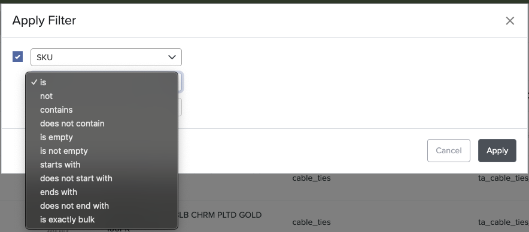<figcaption>
Text string filter options
</figcaption></figure>

<mark style="color:yellow;">**is**</mark> - use this when you're trying to find an exact match with your search term. e.g. "**ABCD1234**"

<mark style="color:yellow;">**not**</mark> - use this when you're trying to find all strings that are NOT equal to your search term

<mark style="color:yellow;">**contains**</mark>**&#x20;-** use this when you're trying to search _within_ a string attribute. For example, if you know the SKU contains "**CD123**" but don't recall the rest.

<mark style="color:yellow;">**does not contain**</mark>**&#x20;-** similar to **contains** above but the reverse. Use this when you're searching for all strings that do NOT contain your search term within.

<mark style="color:yellow;">**is empty**</mark>**&#x20;-** use this when you're trying to filter for attributes that are empty (null)&#x20;

<mark style="color:yellow;">**is not empty**</mark> - use this when you're trying to filter for attributes that are NOT empty, and contain a value

<mark style="color:yellow;">**starts with**</mark>**&#x20;-** use this when you know the beginning portion of a string attribute and want to filter results that only start with your search term. E.g. "ABC" will return all products for which this attribute value begins with "ABC"

<mark style="color:yellow;">**does not start with**</mark>**&#x20;-** opposite of **starts with** above. Use this when you're trying to filter out all results that begin with a certain string.

<mark style="color:yellow;">**ends with**</mark>**&#x20;-** use this when you know the tail end of the string attribute and want to display only results that contain this tail.

<mark style="color:yellow;">**does not end with**</mark>**&#x20;-** use this to filter out all string attributes that end with your search term.

<mark style="color:yellow;">**is exactly bulk**</mark>**&#x20;-** use this to find an exact match on a long list of SKUs. For example, if you have a list of SKUs in a spreadsheet (row by row), you can copy/paste them in bulk to filter only on the SKUs that are equal to the values you've pasted

### Picklist Attribute Filter Options (single-select)

<mark style="background-color:green;">Picklist attributes are dropdown menus. Single select picklists allow only one picklist option to be assigned at a time.</mark>

_<mark style="background-color:green;">Below are the single-select-picklist filter options with examples on how to use them</mark>_

<figure>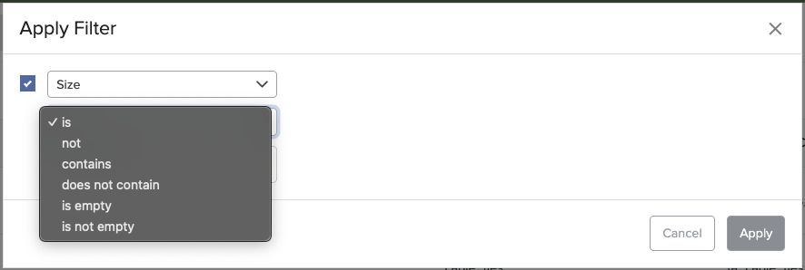<figcaption></figcaption></figure>

<mark style="color:yellow;">**is**</mark> - use this when you're trying to find all products that contain a single picklist value you're searching for  e.g. XL

<figure>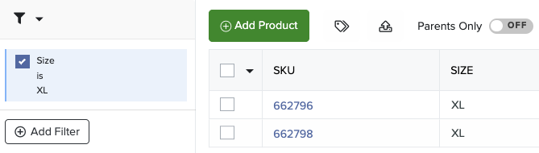<figcaption>
Example: <mark style="color:yellow;">is</mark> XL
</figcaption></figure>

<mark style="color:yellow;">**not**</mark> - use this when you're trying to find all products that are NOT equal to your search term. e.g. NOT XL.

<figure>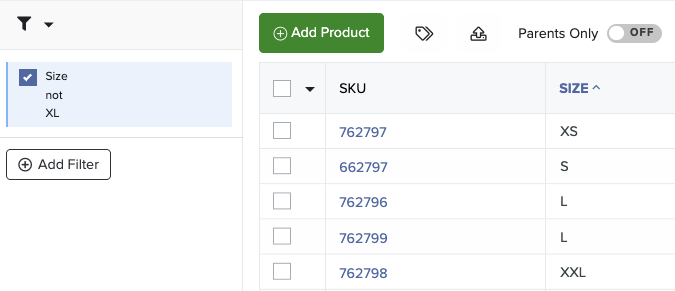<figcaption>
Example: <mark style="color:yellow;">not</mark> XL
</figcaption></figure>

<mark style="color:yellow;">**contains**</mark>**&#x20;-** use this when you're trying to filter for products with several different assigned picklist values. For example, if you want to filter on XS and XXL products, you would use **contains** and select both of these values to show only XS and XXL products.

<figure>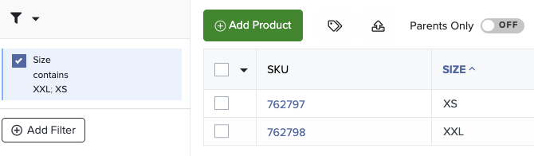<figcaption>
<mark style="color:yellow;"><strong>contains XXL;XS</strong></mark><strong> shows only products with these two values</strong>
</figcaption></figure>

<mark style="color:yellow;">**does not contain**</mark>**&#x20;-** the opposite of contains above. Use this if you want to filter out products with several different picklist values. For example, **does not contain XS and XL** would show you only products in all other sizes (and products with no sizes)

<figure><figcaption>
<mark style="color:yellow;"><strong>does not contain XS; XXL</strong></mark><strong> shows all products NOT in those sizes, including null values</strong>
</figcaption></figure>

<mark style="color:yellow;">**is empty**</mark>**&#x20;-** use this to find all products with no picklist value assigned

<mark style="color:yellow;">**is not empty**</mark>**&#x20;-** use this to filter out all products that have empty (null) picklist values to show only products with assigned picklist values.

<figure>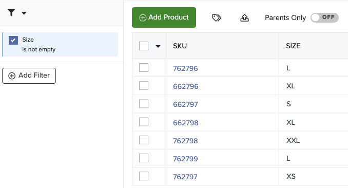<figcaption></figcaption></figure>

### Picklist Attribute Filter Options (multi-select)

<mark style="background-color:green;">Multi-select picklists allow only for multiple dropdown menu values to be assigned to an attribute at time. For example, you may have a picklist that has several different color values selected if you have a multi-color product that is</mark> <mark style="background-color:green;"></mark><mark style="background-color:green;">**black**</mark> <mark style="background-color:green;"></mark><mark style="background-color:green;">and</mark> <mark style="background-color:green;"></mark><mark style="background-color:green;">**blue.**</mark>&#x20;

_<mark style="background-color:green;">Below are the multi-select-picklist filter options with examples on how to use them</mark>_

<figure>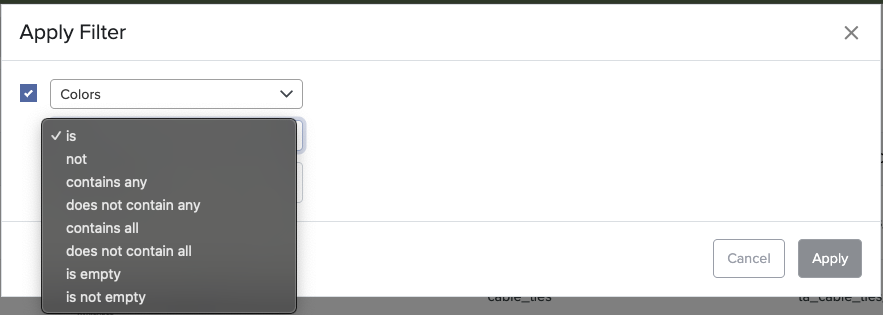<figcaption>
Picklist (multi-select type) filter options
</figcaption></figure>

<mark style="color:yellow;">**is**</mark> - use this when you're trying to find all products that contain the exact picklist value(s) you're searching.&#x20;

<figure>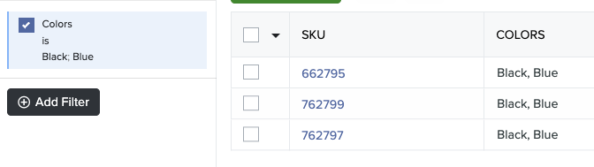<figcaption>
Example: <mark style="color:yellow;"><strong>is</strong></mark><strong> Black, Blue</strong> will show you only products that have <em>BOTH</em> black and blue assigned as their values and nothing else
</figcaption></figure>

<mark style="color:yellow;">**not**</mark> - use this when you're trying to find all products that are _exactly_ NOT equal to your search term(s).

<figure>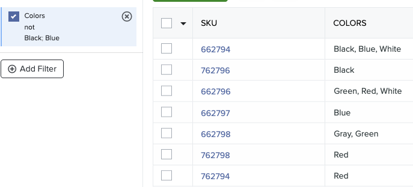<figcaption>
Example: <mark style="color:yellow;"><strong>not</strong></mark><strong> Black, Blue</strong> will filter out products that have <em><strong>BOTH</strong></em> black and blue in their multi-select picklist, but you will still see products that have a <em>lone</em> <strong>black</strong> or <em>lone</em> <strong>blue</strong> value and products that have black, blue, and other colors
</figcaption></figure>

<mark style="color:yellow;">**contains any**</mark>**&#x20;-** Use this when you're trying to find all products that that contain _one or all_ of your selected search values.&#x20;

<figure><figcaption>
Example: <mark style="color:yellow;"><strong>contains any</strong></mark><strong> Black, Blue,</strong> will show you the following products<strong>:</strong>
</figcaption></figure>

<mark style="color:yellow;">**does not contain any**</mark>**&#x20;-** the opposite of contains any above. Use this if you want to _filter out_ products that contain any of the values you search for, but not necessarily all at once.&#x20;

<figure>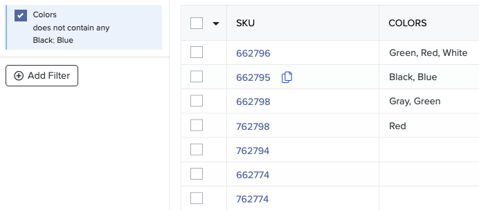<figcaption>
Example: <mark style="color:yellow;"><strong>does not contain any</strong></mark><strong>  Black, Blue</strong> would show you only products that do <em>not</em> contain <em>both</em> black, blue, nor black, nor blue separately)
</figcaption></figure>

<mark style="color:yellow;">**contains all**</mark>**&#x20;-** use this to find products that contain _all_ selected values (this will include products with other unselected values)

<figure>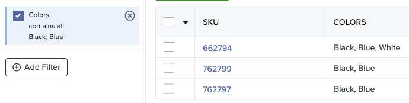<figcaption>
Example: <mark style="color:yellow;">contains all</mark> <mark style="color:yellow;">black; blue</mark> shows products that have both black AND blue + other unselected colors (like white in this case)
</figcaption></figure>

<mark style="color:yellow;">**does not contain all -**</mark> use this to filter out all products that contain ALL selected values

<figure>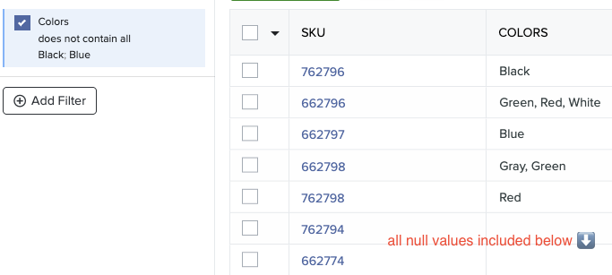<figcaption>
Example: <mark style="color:yellow;"><strong>does not contain all black; blue</strong></mark><strong> shows all products that do NOT have BOTH selected values, but will show products with lone black, blue, and null values</strong>
</figcaption></figure>

<mark style="color:yellow;">**is empty**</mark>**&#x20;-** use this to find all products with no picklist values assigned

<figure>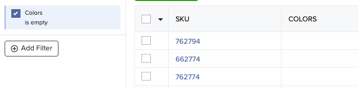<figcaption>
<mark style="color:yellow;"><strong>is empty</strong></mark><strong> -</strong> shows all products with no picklist values assigned
</figcaption></figure>

<mark style="color:yellow;">**is not empty**</mark>**&#x20;-** use this to filter out all products that have empty (null) picklist values to show only products with assigned picklist values.

<figure>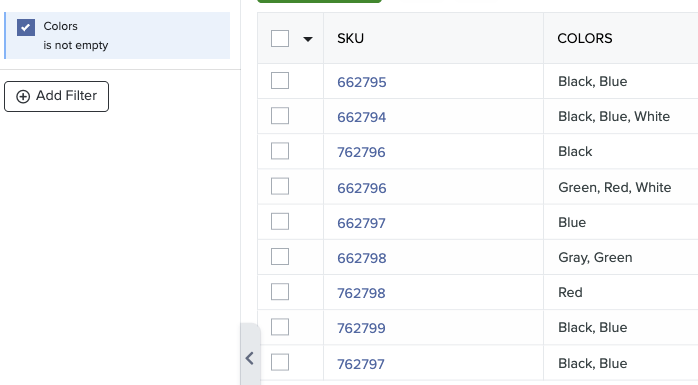<figcaption>
<mark style="color:yellow;"><strong>is not empty</strong></mark><strong> shows all products with non-empty (non-null) values</strong>
</figcaption></figure>

### Other Attribute Type Filter Options

Other attribute types in Catsy offer similar filter options to those highlighted above, making it simple to apply the same logic when using them.\


Parentage Filters

* “Sellables (Standalones and Variants)” (child\_count == 0)
* Standalones only (child\_count == 0 and parent\_sku == null)
* Variants only (parent\_sku != null)
* Parents only (child\_count > 0 and parent\_sku == null)
* Parents and Standalones (parent\_sku == null)
* Parents and Leaders  (child\_count > 0)
* Leaders only (child\_count > 0 and parent\_sku != null)


\
Still have questions about a filter or attribute type not covered here? Feel free to contact us at success@catsy.com. We’re always here to help and continuously updating our knowledge base!&#x20;
