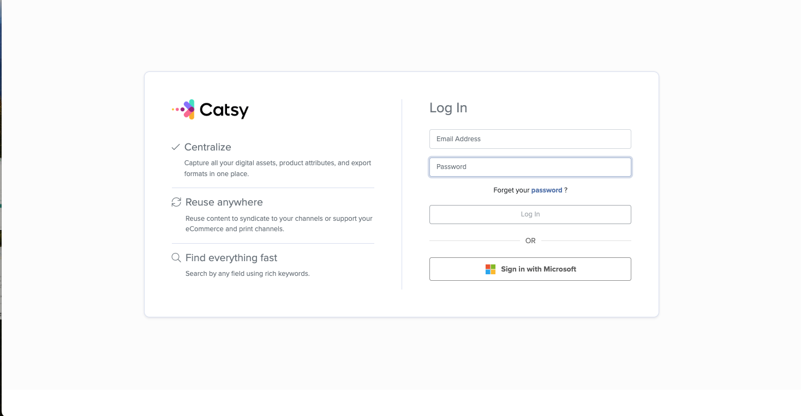

# Connecting BigCommerce to Catsy

 Prerequisites - you need:\
\- a Catsy account with admin access. If you don't have admin access, please contact us at support@catsy.com\
\- access to your BigCommerce Store **as an admin** as well

 Find the Catsy app on the BigCommerce App marketplace:&#x20;

[**https://www.bigcommerce.com/apps/catsy-pim-dam/**](https://www.bigcommerce.com/apps/catsy-pim-dam/)

<figure><figcaption></figcaption></figure>

 Confirm store access to the Catsy app

<figure><figcaption></figcaption></figure>

 Connect to Catsy from your BigCommerce store

If you already have valid Catsy credentials, click '**Login & Connect to Catsy'** to proceed. If you do not yet have access to a Catsy trial account, select '**Request a Demo'** to initiate a new trial and receive access credentials.

<figure><figcaption></figcaption></figure>

 Login to Catsy

<figure><figcaption></figcaption></figure>

 Verify Store Report

Confirm that the store report displayed in the Catsy channel matches the store hash (store-hash). This ensures that the channel is correctly linked to the intended store.

<figure><figcaption></figcaption></figure>

 Import Store Products into Catsy

Navigate to _**Channels → {Catsy Channel} → Import from Store → Import Products**._ This action pulls product data from your store into Catsy. During this process, Catsy automatically:

* Retrieves the latest product details
* Initializes the channel configuration
* Creates baseline attribute mappings in Catsy channel
* Prepares the channel for further setup, enrichment, and publishing

After this import completes, the channel is fully initialized and ready for you to continue configuration and exploration.

<figure><figcaption></figcaption></figure>

 Give support@catsy.com staff permissions

* Go to BigCommerce settings

<figure><figcaption></figcaption></figure>

* Scroll down and click on 'Advanced' > 'Users'

<figure><figcaption></figcaption></figure>

* Click on 'Create a User Account'

<figure><figcaption></figcaption></figure>

* Use the pre-built settings for Store Administrator and create an account for support@catsy.com

<figure><figcaption></figcaption></figure>
