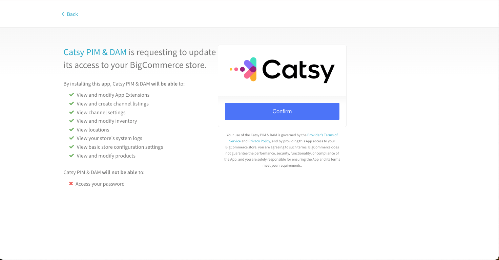
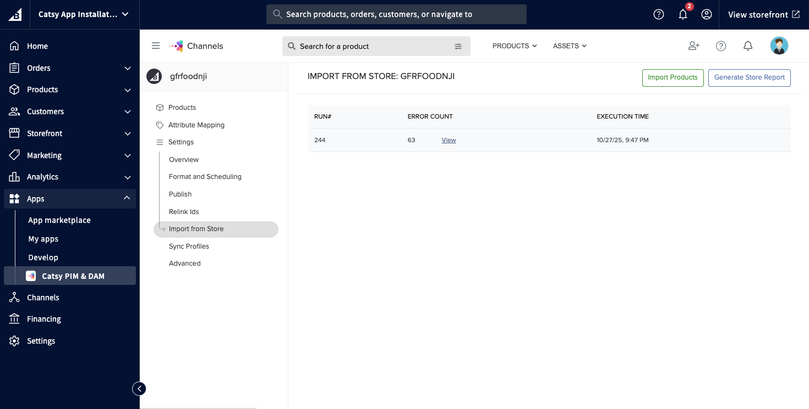

# Connecting BigCommerce to Catsy

**Pre-Requisites:** \
(a) Catsy Account with admin access. \
(b) BigCommerce Store access with admin credentials

Step 1: **Find Catsy App**

<figure><figcaption></figcaption></figure>

Step 2: **Confirm store access to Catsy App**

<figure><figcaption></figcaption></figure>

Step 3: **Access Catsy**

If you already have valid Catsy credentials, click **“Login & Connect to Catsy”** to proceed.\
If you do not yet have access to a Catsy trial account, select **“Request a Demo”** to initiate a new trial and receive access credentials.

<figure><figcaption></figcaption></figure>

Step 4: **Login to Catsy**

<figure><figcaption></figcaption></figure>

Step 5: **Verify Store Report** \
Confirm that the store report displayed in the Catsy channel matches the store hash (store-hash). This ensures that the channel is correctly linked to the intended store.

<figure><figcaption></figcaption></figure>

Step 6: **Import Store Products into Catsy**

Navigate to _**Channels → {Catsy Channel} → Import from Store → Import Products**._\
This action pulls product data from your store into Catsy. During this process, Catsy automatically:

* Retrieves the latest product details
* Initializes the channel configuration
* Creates baseline attribute mappings in Catsy channel
* Prepares the channel for further setup, enrichment, and publishing

After this import completes, the channel is fully initialized and ready for you to continue configuration and exploration.

<figure><figcaption></figcaption></figure>
